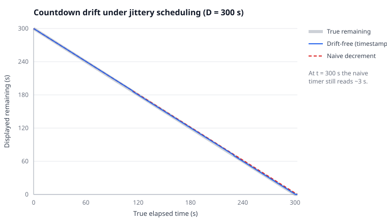

# Drift-Free Countdown: Mathematical Formulation

This document derives the timing model behind [`js/timer.js`](../js/timer.js) (the `Countdown`
class). The engine's single responsibility is to report, at each animation frame, how much of a
fixed hold interval remains — accurately enough that a 30-second stretch is not silently 31 or 29
seconds, and robustly under variable frame rates and background-tab throttling.

## 1. The naive failure mode

The tempting implementation decrements an accumulator once per frame (or once per second):

$$ r_{k+1} = r_k - \Delta_{\text{nominal}}, \qquad r_0 = D, $$

where $D$ is the hold duration and $\Delta_{\text{nominal}}$ is the _assumed_ inter-frame (or
inter-tick) interval. The realised interval $\Delta_k$ is never exactly $\Delta_{\text{nominal}}$:
the HTML event loop runs a timer/callback at or after its deadline, never before it
[[1]](#ref-1). Writing $\Delta_k = \Delta_{\text{nominal}} + \varepsilon_k$ with
$\varepsilon_k \ge 0$, after $N$ steps the displayed remaining is $D - N\Delta_{\text{nominal}}$
while the true elapsed time is

$$ \sum_{k=1}^{N} \Delta_k = N\Delta_{\text{nominal}} + \sum_{k=1}^{N}\varepsilon_k. $$

The displayed value is therefore wrong by $\sum_k \varepsilon_k$, a strictly non-decreasing
quantity: the error is a one-directional accumulation that **grows without bound** in $N$. A
five-minute countdown driven by a once-per-second `setInterval` typically finishes several
seconds late for exactly this reason.

## 2. A monotonic clock

Let $\tau$ denote a reading of a _monotonic_ clock in milliseconds. In the browser this is
`performance.now()`, which returns a `DOMHighResTimeStamp` guaranteed to be monotonically
non-decreasing and independent of system-clock adjustments [[2]](#ref-2). Monotonicity is the
only property we require; the absolute epoch is irrelevant.

## 3. Drift-free formulation

Fix the target time once, at the instant the hold starts ($\tau_0$):

$$ T \;=\; \tau_0 + D. $$

At an arbitrary later frame with clock reading $\tau$, the remaining time is computed — not
accumulated — as

$$ r(\tau) \;=\; \max\!\bigl(0,\; T - \tau\bigr). \tag{3.1} $$

Because $r$ is a pure function of the fixed target $T$ and the single current reading $\tau$, the
error in $r(\tau)$ is bounded by the resolution of one clock sample and is **independent of the
number of frames**. No $\varepsilon_k$ ever enters $r$; there is nothing to accumulate. This is
`Countdown.remainingMs()`.

## 4. Display rule

The on-screen integer is

$$ s(\tau) \;=\; \left\lceil r(\tau)/1000 \right\rceil, \tag{4.1} $$

(`Countdown.remainingSeconds()`). The ceiling is deliberate:

- at $\tau = \tau_0$, $r = D$ and $s = \lceil D/1000\rceil$ shows the **full** duration immediately;
- $s$ reaches $0$ only when $r = 0$ exactly, i.e. at the true end of the hold;
- for any $r \in (0, 1000]$ ms, $s = 1$ — the display reads "1" throughout the final second.

Using $\lfloor \cdot \rfloor$ or rounding would either drop the starting value by one or hit zero
up to half a second early.

## 5. Drift analysis and empirical comparison

Equation (3.1) and the §1 recurrence differ in their error growth: $O(1)$ (bounded by one clock
sample) versus $O(N)$ (cumulative). The figure below simulates both for a $D = 300$ s countdown
sampled once per second under an illustrative late-firing model — each tick delayed by
$3 + U(0,12)$ ms (constants documented in
[`tests/figures/drift-model.js`](../tests/figures/drift-model.js); the $U(0,12)$ term uses a
seeded PRNG so the figure is reproducible).

**How to read it.** The horizontal axis is _true_ elapsed wall-clock time (seconds); the vertical
axis is the _displayed_ remaining time (seconds). The drift-free (blue) line sits on top of the
true-remaining (grey) line for the entire run — at any real instant it shows the correct value to
within the sub-second rounding of (4.1). The naive (red, dashed) line rises above it and, at the
moment the hold should end (true time $= 300$ s), still displays roughly three seconds remaining:
the accumulated $\sum_k \varepsilon_k$. The gap widens monotonically — the visual signature of
unbounded drift. Both properties (engine tracks truth to sub-second; naive error exceeds two
seconds and never decreases) are asserted in [`tests/timer.test.js`](../tests/timer.test.js).

## 6. Pause / resume invariant

Pausing must preserve the remaining time exactly, independent of how long the pause lasts. At a
pause occurring at clock reading $\tau_p$ we store

$$ \rho \;=\; \max\!\bigl(0,\; T - \tau_p\bigr), $$

and cancel the frame loop. At resume, occurring at an arbitrary later reading
$\tau_r \ge \tau_p$, we re-anchor the target:

$$ T' \;=\; \tau_r + \rho. $$

The post-resume remaining at any $\tau \ge \tau_r$ is then

$$ r'(\tau) = T' - \tau = \tau_r + \rho - \tau, $$

so $r'(\tau_r) = \rho$: the countdown continues from precisely the value it held at the pause, and
the wall-clock interval $[\tau_p, \tau_r]$ spent paused contributes nothing. This is the
`pause()`/`resume()` pair; `stop()` performs the same capture of $\rho$ but does not re-anchor.

## 7. Completion

The loop terminates at the first frame where $r(\tau) \le 0$, emitting a final $r = 0$ and firing
`onComplete` exactly once. It cancels itself on completion, so the callback cannot double-fire
(asserted in the test suite).

## 8. Single-phase elapsed and progress

Elapsed time within a hold is the complement $e(\tau) = D - r(\tau)$, and the fractional progress
of a single hold is $e(\tau)/D \in [0,1]$. The aggregation of per-step progress into a
whole-routine progress bar is derived in [`data-model.md`](data-model.md).

## References

[1] WHATWG. _HTML Living Standard_ — Timers (`setTimeout`/`setInterval`):
a timer task is queued when the timeout expires and run when the event loop reaches it; timers may
be delayed, never advanced.
[Link](https://html.spec.whatwg.org/multipage/timers-and-user-prompts.html#timers)

[2] W3C. _High Resolution Time_ — `performance.now()` returns a
monotonically non-decreasing `DOMHighResTimeStamp`. [Link](https://www.w3.org/TR/hr-time-3/)
